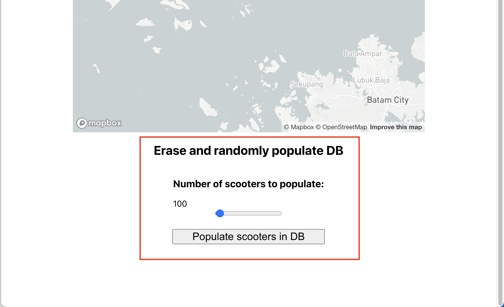

# Beam - Nearest Scooter Project

## How to setup
- This project was built & tested at Mac OS Big Sur (M1 macbook air, running at Rosetta terminal)

### 1. Backend
- Install Brew first if you haven't https://brew.sh/
- Set up PostgreSQL DB and GeoDjango dependencies
- https://docs.djangoproject.com/en/3.2/ref/contrib/gis/install/postgis/
```
$ brew install postgresql
$ brew install postgis
$ brew install gdal
$ brew install libgeoip

$ createdb beam_db
$ psql beam_db
beam_db=# CREATE ROLE beam;
beam_db=# CREATE EXTENSION postgis;
```

- Create Python venv and install Python libraries
- Recommend creating venv using Python 3.9.1
```
$ cd backend
$ python -m venv venv
$ source venv/bin/activate
(venv) $ pip install -r requirements.txt
(venv) $ python manage.py migrate
(venv) $ python manage.py runserver
```

### 2. Frontend
```
$ cd frontend
$ npm install
$ npm start
```
- Go to http://localhost:3000
- On startup, Click Populate to erase existing scooters & randomly populate scooters




